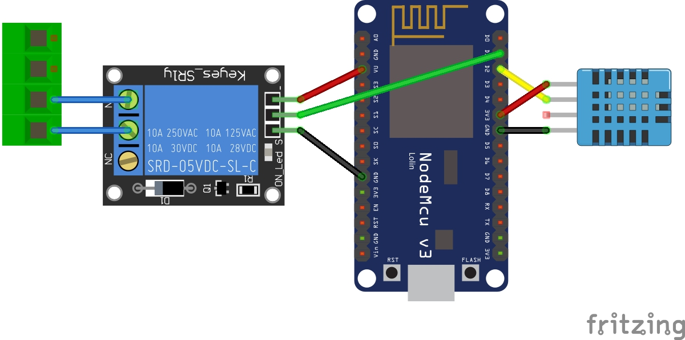

# NodeMCU (ESP8266) Raspberry Pi - Garage Door Control
This project controls your garage door opener using MQTT as the messaging service, ESPHome to configure the ESP8266 module, and a Raspberry Pi to serve the web app shown 
in the demo video. The Raspberry Pi web server is not mandatory. You can trigger the Garage Door with any app that can publish an MQTT message (`garageDoor/trigger` - 
configurable in `garage.yaml` as explained in the [ESPHome](#ESPHome) section below).


## Hardware Requirements
1. Raspberry Pi - any version will work since this will just host the web server 
2. ESPHome set up (Hassio set up will work) 
3. NodeMCU Board (can use any ESP8266 module including D1 Mini)
4. 5v Relay Module
5. DHT11 sensor - for Temperature & Humidity
6. Jumper cables
7. Box for your stuff

## Software Requirements
1. ESPHome - perhaps through Hassio
2. MQTT Broker - any will work. I use Mosquitto installed on my Hassio (which is in turn installed on a Raspberry Pi 4)
3. Apache for the web server - can be installed anywhere but I have it on a RPi Zero W that I use to serve other web content


## Wiring Diagram:

The following diagram is for connecting your NodeMCU to your relay and DHT11 sensor:



#### Connections explained

| Color |  Pin | Connects to |
|-------|:---------:|---------|
| Red (relay)   |    VU    |  VIN on Relay |
| Black (relay)|    Any Ground Pin     | GND on Relay |
| Green  |    D1     | Data pin on Relay |
| Blue   |    Normally Open and Common pins on relay | To garage door controller |
| Red (DHT) | any 3v Pin On NodeMCU | Power on DHT Module| 
| Black (DHT) | Any Ground Pin on NodeMCU | GND on DHT Module| 
| Yellow | D2 | Data Pin on DHT |

The blue wires represent the connections going into the Garage Door control. As you'll see in my demo, The door triggers (open/close/stop) when the two left-most terminals
are connected in any way. When you put the two wires on the normally open connection on  your Relay module, they are not connected. When the connect closes, the door controller
then knows to do something.  

## ESPHome

Upload the contents of `esphome/garage.yaml` to your ESP module using ESPHome. I use Hassio but if you have another method of doing so, it should be fine. 

#### MQTT

The following MQTT configurations are set and are configurable. If you configure the message, you must configure the subscription in `script.js` as shown below. The 
MQTT setup in the YAML is as follows:

```yaml
mqtt:
  broker: {{Broker IP}}
  discovery: True
  username: "your mqtt username"
  password: "your mqtt password"
  topic_prefix: "garage"
  on_message:
    topic: "garageDoor/trigger"
    then:
      - switch.turn_on: garageDoorTemplate
```

If you configure the topic above and if you are using the included web app, you must configure line 40 of `script.js` and publish to the new trigger:

```javascript
client.publish("garageDoor/trigger");
```

#### Celsius v. Fahrenheit v. Kelvin

My YAML converts the default unit of measurement to Fahrenheit. To go back to Celsius, just remove this blcok:

```yaml
filters:
      - lambda: return x * (9.0/5.0) + 32.0;
      unit_of_measurement: "°F"
```

And if you like Kelvin, change the block to this:

```yaml
filters:
      - lambda: return x + 273.15;
      unit_of_measurement: "°K"
```

## (Optional) Raspberry Pi - Apache Web Server

To learn how to install Apache and run a simple app, check out my tutorial on 
[How to Turn your Pi into an Apache Web Server here](https://www.easyprogramming.net/raspberrypi/pi_apache_web_server.php).


## Demo

Check out the demo on YouTube at the following link: [https://www.youtube.com/watch?v=ddv5vsHgYhI](https://www.youtube.com/watch?v=ddv5vsHgYhI)

### Author
Nazmus Nasir - [Easy Programming](https://www.easyprogramming.net)

## Notes
There's no way to tell if the door is open or closed. This is on my to-do list.

## Questions?
If you have questions, there are many ways to get in touch with me! 

1. Ask in the comments section of the YouTube video, I am generally very good at responding to questions. 
2. Ask in the comments section of EasyProgramming.net. Every tutorial comes with a Disqus section to allow a meaninful discussion
3. If a repository exists on Github, open an issue! 
4. This should be used as a last resort because I check this email every once in a while and don't guarantee a response, but if you must, you can use the contact form found here: https://www.easyprogramming.net/contact.php
